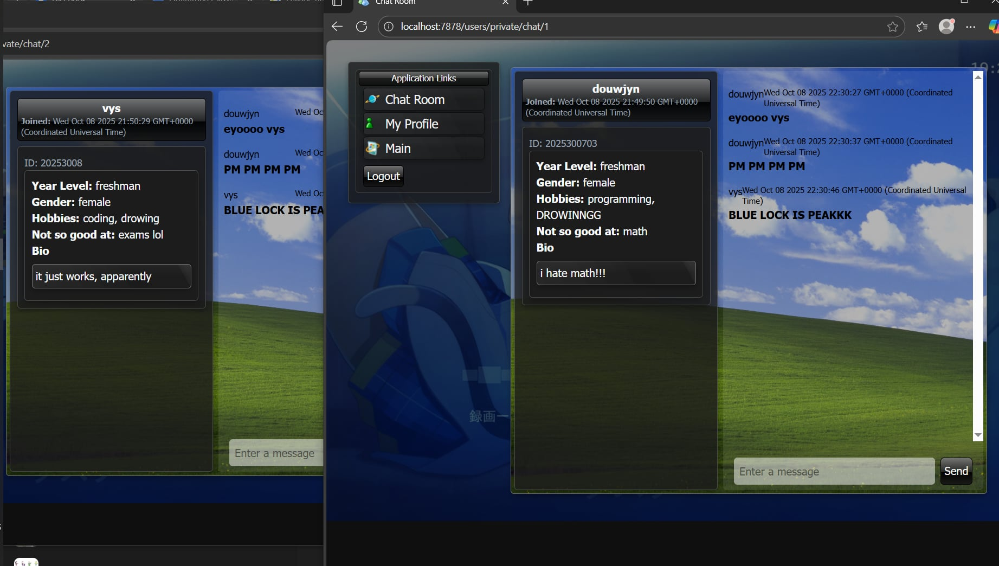
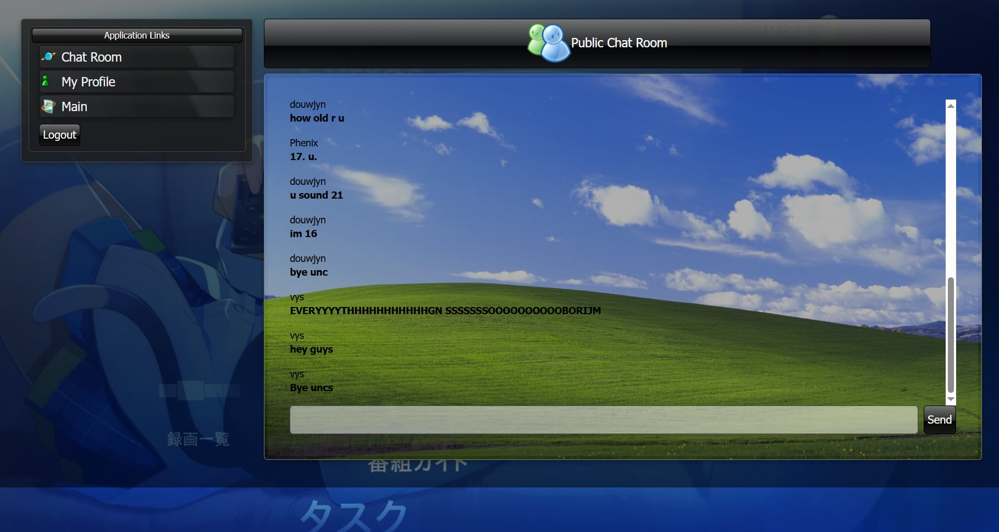

## 🌍 Fruitiger Aero Chat Web App
A fruitiger aero themed chat application that supports public and private chat rooms.
This project is made school-based (<i>though not obvius, will work on it!</i>) with the purpose of helping introverted students like me find some friends.

## Screenshots




## Getting Started

### Prerequisites
- Node.js (v16 or higher)
- npm or yarn package manager

### Installation

1. Clone the repository
```bash
git clone https://github.com/Jyn-Tuyor/fruitiger-aero-chat-app.git
```
2. Install dependencies
```bash
npm install 
```

3. Start the development server
```bash
npm run dev
```

## Tech Stack
- Node.Js & Express.Js
- EJS
- SQLite
- Prisma ORM
- WS for websocket

### Bug Reports

If you find a bug, please open an issue with:
- Clear title and description
- Steps to reproduce
- Expected behavior
- Actual behavior
- Screenshots (if applicable)

### Feature Requests

Have an idea? Open an issue with:
- Clear title and description
- Use case
- Proposed solution (if any)